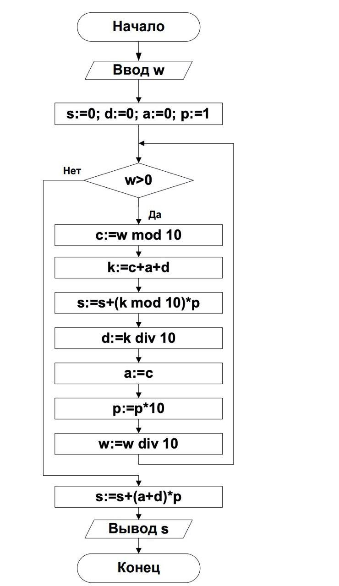

# Решения олимпиадных задач

## 2015-16 гг.
1. [Суммы разрядов](15-16/1.py) (2 балла)  (№1)  
Сколько существует натуральных чисел, меньших 8192, удовлетворяющих следующему условию: если к такому числу
прибавить 1, то сумма цифр в двоичной записи получившегося числа окажется ровно в 3 раза меньше, чем сумма цифр в
двоичной записи исходного числа.  
В ответе укажите целое число.

5. [Найти все](15-16/5.py) (3 балла)  (№5)  
   Найдите все значения переменной w, которые можно подать на вход алгоритма для того, чтобы выполнились
следующие условия:  

     
   
   1. На выходе алгоритма получилось значение переменной k, равное 5.  
   2. Все элементы массива a, значения которых получались во время выполнения алгоритма, оказались двузначными
натуральными числами.  

   В ответе укажите одно натуральное число – сумму найденных значений w.
   
 6. [Бегущая строка](15-16/6.py)  (№6)  
   Строки, состоящие из последовательностей цифр, формируются следующим образом.  Первая строка состоит из четырех
единиц. Каждая из последующих строк создается следующим действием: берется предыдущая строка и после каждой ее
цифры вставляется цифра на единицу большая. Вот первые 3 строки, созданные по этому правилу:  
(1) 1111  
(2) 12121212  
(3) 1223122312231223  
Сколько цифр 5 и сколько цифр 7 будет в строке с номером (9)? В ответе укажите через пробел два целых числа:  
сначала количество цифр 5 в девятой строке, а затем количество цифр 7 в девятой строке.  

## 2016-17 гг.

1. [Огромное число](16-17/1.py) (3 балла)  (№1)  
  Вася получил длинную последовательность из цифр следующим образом. Он брал подряд натуральные числа, начиная с
1, переводил их в четверичную систему счисления и записывал результаты перевода друг за другом. Вот начало этой
последовательности:
123101112132021222330313233100…  
Вася остановился только тогда, когда дописал в конец последовательности четверичную запись числа 102310.  
Затем он представил, что это одно большое число, записанное в четверичной системе счисления, и перевел его в
шестнадцатеричную систему счисления.  
Определите, какая шестнадцатеричная цифра стоит в этом числе на 60-ой позиции, считая слева направо от начала
числа, а затем какая шестнадцатеричная цифра стоит на 1000-ой позиции.   
В ответе укажите эти две шестнадцатеричные
цифры в указанном порядке через пробел.

5. [Вычислитель](16-17/5.py) (2 балла) (№5)
    
  Дана блок-схема алгоритма.  
  Какое целое положительное число w необходимо подать на вход, чтобы после завершения
  алгоритма получилось значение s=96415?  
  В ответе укажите целое число.

##2017-18 гг.
1. [Остатки](17-18/1.py) (2 балла)  (№6)  

  
  Какое целое положительное число W должно быть введено, чтобы в качестве вывода программа напечатала «yes»?
  Нумерация элементов целочисленного массива а начинается с 0. Оператор A mod B вычисляет остаток от
  целочисленного деления A на B, Оператор A div B вычисляет частное от целочисленного деления A на B. В ответе
  укажите целое число.  
  